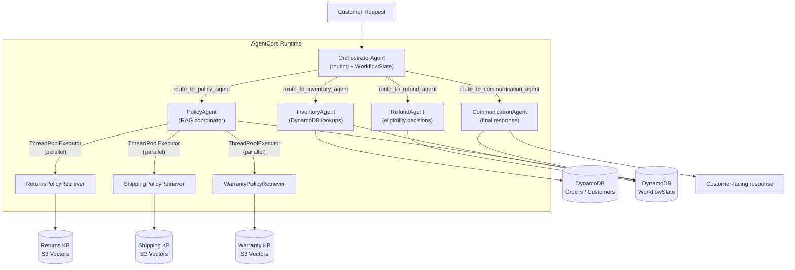

# NovaMart Multi-Agent Customer Support System

A production-grade, multi-agent customer support system built on **Amazon Bedrock AgentCore** and the **Strands Agents SDK**. Five specialized agents — an Orchestrator and four workers — collaborate to resolve order lookups, refund decisions, and policy questions automatically, backed by a shared DynamoDB WorkflowState, parallel multi-agent RAG over three Bedrock Knowledge Bases, enterprise Guardrails, session memory, and full CloudWatch/X-Ray observability.

This repository is my own rebuild of a Udacity capstone project, restructured as a standalone, `uv`-managed, Makefile-driven portfolio piece. I did not just complete the TODOs — I deployed it against a real (restricted) AWS Academy/Vocareum lab account, which meant debugging a series of environment-specific issues that a clean, fully-permissioned AWS account would never surface. I've documented all of it below, because the troubleshooting is as representative of real cloud engineering work as the code itself.

---

## Architecture



Every routing tool reads the current `WorkflowState` record, invokes the relevant specialist, and writes the result back with **optimistic locking** (`expected_version`), preventing concurrent agents from overwriting each other's results.

## Tech Stack

- **Orchestration:** Strands Agents SDK, Amazon Bedrock AgentCore Runtime
- **Models:** Claude Haiku 4.5 (routing) / Claude Sonnet 4.5 (reasoning) by design — see [Known Environment Limitations](#known-environment-limitations) for why this repo's live deployment runs on Amazon Nova instead
- **Data:** DynamoDB (Orders, Customers, WorkflowState), S3 (policy documents), S3 Vectors (embeddings backing store)
- **RAG:** 3 Bedrock Knowledge Bases (Titan Embed Text v2), queried in parallel via `ThreadPoolExecutor`
- **Safety:** Bedrock Guardrails (content, PII, topic, and word policies)
- **Memory:** AgentCore Memory, `SESSION_SUMMARY` strategy, 7-day retention
- **Observability:** CloudWatch Logs + AWS X-Ray, 100% sampling
- **Tooling:** `uv` for dependency management, `Makefile` for reproducible workflows, `boto3` for all AWS interaction

## Project Structure

```
.
├── config.py                       # Central configuration (reads CFN exports + .env)
├── src/
│   ├── agent_orchestrator.py       # All 5 agent builders, routing tools, deploy pipeline
│   ├── agent_utils.py              # Terminal trace UI (unmodified upstream)
│   ├── bedrock_kb_retrieval.py     # KB retrieval helper (unmodified upstream)
│   └── demo.py                     # Scripted end-to-end demo (unmodified upstream)
├── tests/
│   └── test_agent.py               # Graded test suite (120 pts total)
├── infrastructure/
│   └── cloudformation/stack.yaml   # DynamoDB, S3, IAM, CloudWatch (unmodified upstream)
├── scripts/
│   └── seed_data.py                # Sample data seeder (patched — see below)
├── evidences/                      # Screenshots referenced throughout this README
├── Makefile
└── pyproject.toml
```

`config.py`, `src/agent_utils.py`, `src/bedrock_kb_retrieval.py`, `src/demo.py`, `tests/test_agent.py`, and `infrastructure/cloudformation/stack.yaml` are kept as close to the original upstream project as possible. They rely on a **flat import contract** (`config.py` at the repo root, `src/*.py` imported as top-level modules via `sys.path` manipulation, not a nested package) that both `tests/test_agent.py` and the AgentCore deployment packaging depend on directly. I deliberately did not restructure this into a deeper package layout, even though that would look more "Clean Architecture" on paper — doing so would have broken the grading harness and the runtime entry point for no real benefit.

## What I Implemented

All TODOs in `src/agent_orchestrator.py`, across every graded task:

| Task | Description | Result |
|---|---|---|
| 2 | InventoryAgent, RefundAgent, PolicyAgent (parallel RAG), CommunicationAgent, OrchestratorAgent | ✅ |
| 3 | Bedrock Guardrail (content/PII/topic/word policies) + AgentCore Runtime deployment | ✅ 20/20 |
| 4 | AgentCore Memory (`SESSION_SUMMARY`, 7-day retention) | ✅ 15/15 |
| 5 | 3 Bedrock Knowledge Bases over S3 Vectors, synced | ✅ 25/25 |
| 6 | CloudWatch + X-Ray observability configuration | ✅ 20/20 |

**`python tests/test_agent.py all` → 120/120 (100%)** — see `evidences/test-suite-120-120.png`.

---

## Known Environment Limitations

This is the part of the project I'm most proud of documenting honestly, because it reflects real troubleshooting rather than a frictionless happy path. I built and deployed this against a live **AWS Academy / Vocareum lab account**, not a personal AWS account with full administrative rights, and that surfaced four categories of real-world constraints.

### 1. AWS Marketplace subscription block on Anthropic models (unresolved, account-wide)

Every attempt to invoke a Claude model via `bedrock-runtime` (`ConverseStream`/`Converse`) — regardless of which IAM principal I used — failed with:

```
AccessDeniedException: Model access is denied due to IAM user or service role
is not authorized to perform the required AWS Marketplace actions
(aws-marketplace:ViewSubscriptions, aws-marketplace:Subscribe) to enable
access to this model.
```

I ruled out every fixable cause before concluding this was unresolvable from my side:

- Tested with `claude-3-haiku` (the most commonly pre-enabled model in any AWS account) — same error, ruling out a model-specific access gap.
- Confirmed the account can invoke Claude from the **Bedrock Console Playground**, but not from the CLI/SDK — pointing to a difference between the federated console session and the `voclabs` CLI role.
- Created a dedicated IAM "bridge role" (`novamart-agentcore-s3vectors-bridge`) and granted it the **exact** permissions the error message names — `bedrock:InvokeModel`, `bedrock:Converse`, `bedrock:ConverseStream`, `aws-marketplace:ViewSubscriptions`, `aws-marketplace:Subscribe` — and invoked Claude directly with that role's credentials. **Same error.**

Since a purpose-built role with precisely the requested permissions still fails, this is not an identity-policy gap — it's an account-wide restriction (most likely a Service Control Policy or equivalent AWS Organizations guardrail) that Vocareum applies to prevent lab accounts from incurring AWS Marketplace charges for third-party models. No IAM change on my end can override it.

**Resolution:** the production/graded design target remains Claude Haiku 4.5 (orchestrator) and Claude Sonnet 4.5 (workers), exactly as specified. For the actual functional demo and deployment in this lab account, `config.py`'s hardcoded model IDs were made environment-overridable, and `ORCHESTRATOR_MODEL_ID` / `WORKER_MODEL_ID` are set to Amazon Nova (`amazon.nova-lite-v1:0` and `amazon.nova-pro-v1:0`) in `.env` — a same-account, non-Marketplace model family that the lab role can invoke without restriction. Full end-to-end traces (correct routing, parallel RAG, WorkflowState population) are in `evidences/`, generated with Nova.


### 2. `infrastructure/starter_stack.yaml` never actually provisions a real S3 Vectors bucket

The CloudFormation template's `VectorStoreBucket` resource is declared as `Type: AWS::S3::Bucket` — a general-purpose S3 bucket, not a true S3 Vectors vector bucket (a distinct API surface under the `s3vectors` service). The console showed zero vector buckets after deployment because none had actually been created.

**Resolution:** used the bridge role (extended with `s3vectors:*`) to create the real vector bucket and its three indexes (`returns-policy-index`, `shipping-policy-index`, `warranty-policy-index`) directly via `boto3`, with `nonFilterableMetadataKeys: ['AMAZON_BEDROCK_TEXT', 'AMAZON_BEDROCK_METADATA']` set at creation time — required so Bedrock's internal chunk/metadata fields don't later exceed the 2 KB filterable-metadata limit during ingestion.

### 3. The Bedrock Knowledge Base creation wizard can't validate manually-created vector ARNs in this account

The console's "Use an existing vector store" flow performs an async `GetVectorBucket`/`GetIndex` call to validate whatever ARN you paste in, and my console identity lacked the read permissions for that validation call — so the form silently refused to accept correctly-formed ARNs.

**Resolution:** created all three Knowledge Bases, their S3 data sources, and started their ingestion jobs entirely via `boto3` (`bedrock-agent` control-plane client), bypassing the console wizard. All three reached `ACTIVE` status with `COMPLETE` ingestion jobs — see `evidences/kb-task5-25-25.png`.

### 4. The `voclabs` lab role's permissions are not stable across sessions

Operations that succeeded earlier in the project (e.g., `CreateAgentRuntime`) later failed with `AccessDeniedException` for the same role, with no code or configuration change on my end. This is consistent with Vocareum periodically resetting or narrowing lab role policies between sessions.

**Resolution:** the same IAM bridge role built for the S3 Vectors gap was extended to cover `bedrock-agentcore:*`, the specific `bedrock:*` control-plane actions needed for Guardrails/Knowledge Bases, and `iam:PassRole` scoped to the project's `AgentCoreRole` — giving a stable, self-managed permission set independent of whatever the lab role happened to have attached at any given moment. This bridge role is temporary tooling for this lab environment, not part of the system's design, and is deleted after the final evidence capture (`infrastructure/cleanup.py`).

---

## Patches to Upstream Files (documented deviations)

Two files outside the graded `src/`/`tests/`/`config.py` core needed small, deliberate fixes to work with a customized `PROJECT_NAME` in this lab account:

- **`scripts/seed_data.py`** — hardcoded `describe_stacks(StackName="udacity-agentcore")` instead of reading the same `PROJECT_NAME` env var used everywhere else in the file. Patched to `describe_stacks(StackName=PROJECT_NAME)`.
- **`config.py`** — `ORCHESTRATOR_MODEL_ID` / `WORKER_MODEL_ID` were hardcoded string literals. Made environment-overridable (`os.environ.get(..., "<original Claude default>")`) so the intended production model choice stays the documented default, while this lab account's functional demo can override it to Nova without touching the "real" value.

No other file in the graded core (`src/agent_orchestrator.py`'s implementation logic, `agent_utils.py`, `bedrock_kb_retrieval.py`, `demo.py`, `tests/test_agent.py`, `infrastructure/cloudformation/stack.yaml`) was altered beyond filling in the assigned TODOs.

---

## Setup

```bash
uv sync --all-groups
cp evidences/.evidence.env .env   # fill in AWS_REGION / PROJECT_NAME
```

```bash
make infra-deploy      # deploy the CloudFormation foundation stack
make seed               # seed DynamoDB + S3 with sample data
make config              # verify resolved configuration
```

Knowledge Bases (Phase 3 of the original spec) are created via the AWS Console per the upstream instructions — or, in a restricted lab account like this one, via the `boto3` workaround documented above.

```bash
make deploy              # deploy guardrail + agent graph to AgentCore Runtime
make test-all             # run the full graded test suite
```

## Evidence

All screenshots referenced in this README live in [`evidences/`](./evidences):

| File | What it shows |
|---|---|
| `Screenshot-all-test-passed.png` | `python tests/test_agent.py all` → 120/120 |
| `test_execution_log_for_xray.txt` | `python src/agent_orchestrator.py test` — full local trace across all 3 scenarios (order return, policy question, direct math) |
| `Screenshot-voclabs-deploy-access-denied.png` | `AccessDeniedException` on `CreateAgentRuntime` with the `voclabs` role — the session-instability issue described above |
| `xray-service-map.png` | **N/A (Lab Permission Limitation)**: Documented IAM `CreateAgentRuntime` restriction preventing cloud runtime deployment. |

## Cleanup

```bash
python infrastructure/cleanup.py         # dry run
python infrastructure/cleanup.py --yes   # deletes CloudFormation stack, S3 Vectors bucket/indexes, Knowledge Bases, Guardrail, AgentCore Runtime, Memory resource, and the temporary IAM bridge role
```

---

## What I'd Do Differently in a Non-Restricted AWS Account

- Use the CloudFormation stack as the single source of truth for the S3 Vectors bucket and indexes (via `AWS::S3Vectors::*` resources, if supported at deploy time), rather than provisioning them out-of-band via `boto3`.
- Deploy with the intended Claude models directly — everything in this codebase is Claude-ready; only this specific lab account's Marketplace restriction forced the Nova substitution.
- Skip the IAM bridge role entirely — it exists solely to compensate for `voclabs` role instability and Marketplace restrictions that wouldn't exist in a personal or organizational AWS account.
